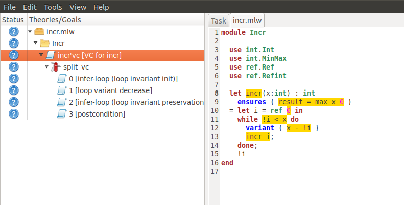

.. _sec.install:

Compilation, Installation
=========================

Installing Why3
---------------

Installation via Opam
~~~~~~~~~~~~~~~~~~~~~

The simplest way to install Why3 is via Opam, the OCaml package manager. It
is as simple as

::

    opam install why3

Then jump to :numref:`provers` to install external provers.

Installation via Docker
~~~~~~~~~~~~~~~~~~~~~~~

Instead of compiling Why3, one can also execute a precompiled version
(for *amd64* architecture) using Docker. The image containing Why3
as well as a few provers can be recovered using

.. parsed-literal::

   docker pull registry.gitlab.inria.fr/why3/why3:|release|
   docker tag  registry.gitlab.inria.fr/why3/why3:|release| why3

Let us suppose that there is a file :file:`foo.mlw` in your current
directory. If you want to verify it using Z3, you can type

.. code-block:: shell

    docker run --rm --volume `pwd`:/data --workdir /data why3 prove foo.mlw -P z3

If you want to verify :file:`foo.mlw` using the graphical user interface,
the invocation is slightly more complicated as the containerized
application needs to access your X server:

.. code-block:: shell

    docker run --rm --network host --user `id -u` --volume $HOME/.Xauthority:/home/guest/.Xauthority --env DISPLAY=$DISPLAY --volume `pwd`:/data --workdir /data why3 ide foo.mlw

It certainly makes sense to turn this command line into a shell script for easier use:

.. code-block:: shell

    #!/bin/sh
    exec docker run --rm --network host --user `id -u` --volume $HOME/.Xauthority:/home/guest/.Xauthority --env DISPLAY=$DISPLAY --volume `pwd`:/data --workdir /data why3 "$@"

Installation from Source Distribution
~~~~~~~~~~~~~~~~~~~~~~~~~~~~~~~~~~~~~

In short, installation from sources proceeds as follows.

::

    ./configure
    make
    make install

After unpacking the distribution, go to the newly created directory
|whypath|. Compilation must start with a configuration phase which is
run as

::

    ./configure

This analyzes your current configuration and checks if requirements
hold. Compilation requires:

-  The Objective Caml compiler. It is available as a binary package for
   most Unix distributions. For Debian-based Linux distributions, you
   can install the packages

   ::

       ocaml ocaml-native-compilers

   It is also installable from sources, downloadable from the site
   http://caml.inria.fr/ocaml/

For some of the Why3 tools, additional OCaml libraries are needed:

-  For the graphical interface, the Lablgtk2 library is needed. It
   provides OCaml bindings of the gtk2 graphical library. For
   Debian-based Linux distributions, you can install the packages

   ::

       liblablgtk2-ocaml-dev liblablgtksourceview2-ocaml-dev

   It is also installable from sources, available from the site
   http://wwwfun.kurims.kyoto-u.ac.jp/soft/olabl/lablgtk.html

If you want to use the Coq realizations (:numref:`sec.realizations`),
then Coq has to be installed before Why3. Look at the summary printed at
the end of the configuration script to check if Coq has been detected
properly. Similarly, in order to use PVS (:numref:`sec.pvs`) or Isabelle
(:numref:`sec.isabelle`) to discharge proofs, PVS and Isabelle must be
installed before Why3. You should check that those proof assistants are
correctly detected by the :file:`configure` script.

When configuration is finished, you can compile Why3.

::

    make

Installation is performed (as super-user if needed) using

::

    make install

Installation can be tested as follows:

#. install some external provers (see :numref:`provers` below)

#. run :option:`why3 config --detect`

#. run some examples from the distribution, e.g., you should obtain the
   following (provided the required provers are installed on your
   machine):

   .. code-block:: console

       > cd examples
       > why3 replay logic/scottish-private-club
        1/1 (replay OK)
       > why3 replay same_fringe
        18/18 (replay OK)

Local Use, Without Installation
^^^^^^^^^^^^^^^^^^^^^^^^^^^^^^^

It is not mandatory to install Why3 into system directories. Why3 can be
configured and compiled for local use as follows:

::

    ./configure --enable-local
    make

The Why3 executable files are then available in the subdirectory :file:`bin/`.
This directory can be added in your :envvar:`PATH`.

.. _sec.installlib:

Installation of the Why3 API
^^^^^^^^^^^^^^^^^^^^^^^^^^^^

By default, the Why3 API is not installed. It can be installed using

::

    make byte opt
    make install-lib

Beware that if your OCaml installation relies on Opam installed in your
own user space, then ``make install-lib`` should *not* be run as
super-user.

Removing Installation
^^^^^^^^^^^^^^^^^^^^^

Removing installation can be done using

::

    make uninstall
    make uninstall-lib

.. _provers:

Installing External Provers
---------------------------

Why3 can use a wide range of external theorem provers. These need to be
installed separately, and then Why3 needs to be configured to use them.
There is no need to install automatic provers, e.g., SMT solvers, before
compiling and installing Why3. For installation of external provers,
please refer to the specific section about provers from
http://why3.lri.fr/. (If you have installed Why3 via Opam, note that you can
install the SMT solver Alt-Ergo via Opam as well.)

Once you have installed a prover, or a new version of a prover, you have
to run the following command:

::

    why3 config --detect

It scans your :envvar:`PATH` for provers and updates your configuration file
(see :numref:`sec.why3config`) accordingly.

Multiple Versions of the Same Prover
~~~~~~~~~~~~~~~~~~~~~~~~~~~~~~~~~~~~

Why3 is able to use several versions of the same prover, e.g., it can use both
CVC4 1.4 and CVC4 1.5 at the same time. The automatic detection of
provers looks for typical names for their executable command, e.g., :program:`cvc4`
for CVC3. However, if you install several versions of the same prover it
is likely that you would use specialized executable names, such as
:program:`cvc4-1.4` or :program:`cvc4-1.5`. If needed, option
:option:`why3 config --add-prover` can be
added to specify names of prover executables:

::

    why3 config --add-prover cvc4 cvc4-dev /usr/local/bin/cvc4-dev

the first argument (here ``cvc4``) must be one of the family of provers
known. The list of these famillies can be obtain using
:option:`why3 config --list-prover-families`.

as they are in fact listed in the file :file:`provers-detection-data.conf`,
typically located in :file:`/usr/local/share/why3` after installation. See
:numref:`sec.proverdetectiondata` for details.

.. _sec.uninstalledprovers:

Session Update after Prover Upgrade
~~~~~~~~~~~~~~~~~~~~~~~~~~~~~~~~~~~

If you happen to upgrade a prover, e.g., installing CVC4 1.5 in place of CVC4
1.4, then the proof sessions formerly recorded will still refer to the
old version of the prover. If you open one such a session with the GUI,
and replay the proofs, a popup window will show up for asking you to
choose between three options:

-  Keep the former proof attempts as they are, with the old prover
   version. They will not be replayed.

-  Remove the former proof attempts.

-  Upgrade the former proof attempts to an installed prover (typically
   an upgraded version). The corresponding proof attempts will become
   attached to this new prover, and marked as obsolete, to make their
   replay mandatory. If a proof attempt with this installed prover is
   already present the old proof attempt is just removed. Note that you
   need to invoke again the replay command to replay those proof
   attempts.

-  Copy the former proofs to an installed prover. This is a combination
   of the actions above: each proof attempt is duplicated, one with the
   former prover version, and one for the new version marked as
   obsolete.

Notice that if the prover under consideration is an interactive one,
then the copy option will duplicate also the edited proof scripts,
whereas the upgrade-without-copy option will just reuse the former proof
scripts.

Your choice between the three options above will be recorded, one for
each prover, in the Why3 configuration file. Within the GUI, you can
discard these choices via the :menuselection:`Files --> Preferences` dialog: just click on one choice to remove
it.

Outside the GUI, the prover upgrades are handled as follows. The
:why3:tool:`replay` command will take into account any prover upgrade policy
stored in the configuration. The :why3:tool:`session` command performs move or
copy operations on proof attempts in a fine-grained way, using filters,
as detailed in :numref:`sec.why3session`.

.. _sec.installinferloop:

Inference of Loop Invariants
----------------------------

This section shows how to install and use *infer-loop*, an utility
based on *abstract interpretation* to infer loop invariants
:cite:`baudin17`. This is still work in progress and many features are
still very limited.

Installation
~~~~~~~~~~~~

The ``infer-loop`` utility has the following OCaml dependencies.

-  ``apron``: can be installed using ``opam``.

-  ``camllib``: can be installed using ``opam``.

-  ``fixpoint``: follow instructions below.

The ``fixpoint`` library is not available in ``opam`` but it can be
easily installed by downloading its sources and compiling them. The
following commands are just an example of how the library can be
installed and can be performed in any directory.

::

    svn co svn://scm.gforge.inria.fr/svnroot/bjeannet/pkg/fixpoint
    cd fixpoint/trunk/
    cp Makefile.config.model Makefile.config
    # if required make modifications to Makefile.config
    make all     # compiles
    make install # uses ocamlfind to install the library

By default *infer-loop* is not compiled and integrated with Why3. So,
once the dependencies above are installed, the configuration script of
Why3 should enable the compilation of the ``infer-loop`` utility, as
follows:

::

    ./configure --enable-infer
    # ...
    Components
        Invariant inference(exp): yes
    # ...

Running Why3 with infer-loop
~~~~~~~~~~~~~~~~~~~~~~~~~~~~

Why3 can now be executed with support for inferring loop
invariants. This can be done by passing the *debug* flag
``infer-loop`` to Why3 or by annotating *let* declarations with
the ``[@infer]`` attribute.

As an example consider the following invocation of Why3.

::

   why3 ide tests/infer/incr.mlw --debug infer-loop

In this case, Why3 will infer invariants for all the loops inside all
the let declarations. Note that, the *Polyhedra* default domain will
be used together with the default widening value of *3*. Why3 GUI will
not display the inferred invariants in the source code, but the VCs
corresponding to those invariants will be displayed and labeled with
the ``infer-loop`` keyword as shown in :numref:`fig.gui.infer`.

.. _fig.gui.infer:

Alternatively, attributes can be used in let declarations so that
invariants are inferred for all the loops in that declaration. In this
case, it is possible to select the desired domain and widening
value. In the example below, invariants will be inferred using the
*Polyhedra* domain and a widening value of *4*. These two arguments of
the attribute can swapped, for instance, ``[@infer:Polyhedra:4]`` will
produce exactly the same invariants.

.. code-block:: whyml

  module Incr

    use int.Int
    use int.MinMax
    use ref.Ref
    use ref.Refint

    let incr[@infer:4:Polyhedra](x:int) : int
      ensures { result = max x 0 }
    = let i = ref 0 in
      while !i < x do
        variant { x - !i }
        incr i;
      done;
      !i
  end
