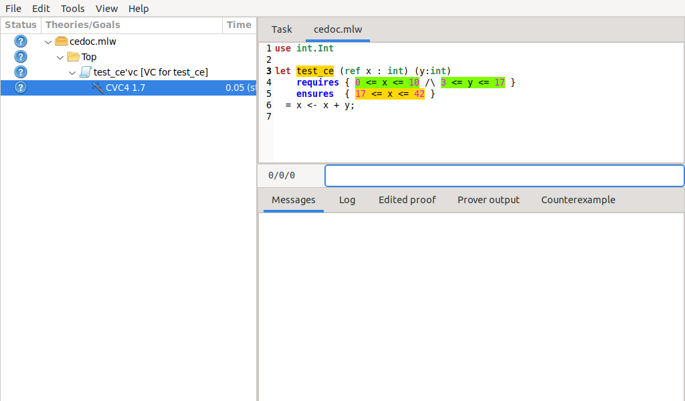
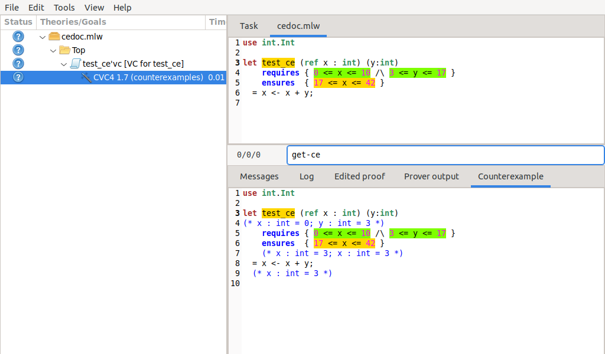
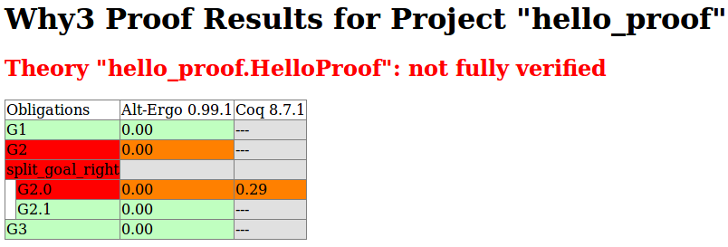

.. _chap.manpages:

Reference Manuals for the Why3 Tools
====================================

.. program:: why3

This chapter details the usage of each of the command-line tools
provided by the Why3 environment. The main command is :program:`why3`; it acts
as an entry-point to all the features of Why3. It is invoked as such

::

    why3 [general options...] <command> [specific options...]

The following commands are available:

:why3:tool:`config`
    manages the user’s configuration, including the detection of
    installed provers.

:why3:tool:`doc`
    produces HTML versions of Why3 source codes.

:why3:tool:`execute`
    performs a symbolic execution of WhyML input files.

:why3:tool:`extract`
    generates an OCaml program corresponding to WhyML input files.

:why3:tool:`ide`
    provides a graphical interface to display goals and to run provers
    and transformations on them.

:why3:tool:`pp`
    pretty-prints WhyML definitions (formatting :file:`.mlw` files
    or printing inductive definitions to LaTeX).

:why3:tool:`prove`
    reads WhyML input files and calls provers, on the command-line.

:why3:tool:`realize`
    generates interactive proof skeletons for Why3 input files.

:why3:tool:`replay`
    replays the proofs stored in a session, for regression test
    purposes.

:why3:tool:`session`
    dumps various informations from a proof session, and possibly
    modifies the session.

:why3:tool:`wc`
    gives some token statistics about WhyML source files.

All these commands are also available as standalone executable files, if
needed.

The commands accept a common subset of command-line options. In
particular, option :option:`--help` displays the usage and options.

.. option:: -L <dir>, --library <dir>

   Add ``<dir>`` in the load path, to search for theories.

.. option:: -C <file>, --config <file>

   Read the configuration from the given file. See :numref:`sec.whyconffile`.

.. option:: --extra-config <file>

   Read additional configuration from the given file.

.. option:: --list-debug-flags

   List known debug flags.

.. option:: --list-transforms

   List known transformations.

.. option:: --list-printers

   List known printers.

.. option:: --list-provers

   List known provers.

.. option:: --list-formats

   List known input formats.

.. option:: --list-metas

   List known metas.

.. option:: --debug-all

   Set all debug flags (except flags that change the behavior).

.. option:: --debug <flag>

   Set a specific debug flag.

.. option:: --help

   Display the usage and the exact list of options for the given tool.

.. envvar:: WHY3CONFIG

   Indicate where to find the :file:`why3.conf` file. Can be overwritten using
   the :option:`--config` option.

.. index:: configuration file
.. why3:tool:: config
.. _sec.why3config:

The ``config`` Command
----------------------

.. program:: why3 config

Why3 must be configured to access external provers. Typically, this is
done by running the :program:`why3 config` command. This must be done each time a
new prover is installed.

The provers that Why3 attempts to detect are described in the readable
configuration file :file:`provers-detection-data.conf` of the Why3 data
directory (e.g., :file:`/usr/local/share/why3`). Advanced users may try to modify
this file to add support for detection of other provers. (In that case,
please consider submitting a new prover configuration on the bug
tracking system.)

The result of provers detection is stored in the user's configuration
file (see :numref:`sec.whyconffile`). This file is also
human-readable, and advanced users may modify it in order to experiment
with different ways of calling provers, e.g., different versions of the same
prover, or with different options.
The :why3:tool:`config` command also detects the :index:`plugins <plugin>` installed in the Why3
plugins directory (e.g., :file:`/usr/local/lib/why3/plugins`).

If the user’s configuration file is already present, :why3:tool:`config` will
only reset unset variables to default value, but will not try to detect
provers and plugins. Options :option:`--detect-provers` and
:option:`--detect-plugins` can be used in that case.
If a supported prover is installed under a name that is not
automatically recognized by :why3:tool:`config`, the :option:`--add-prover` option
can be used to add a specified binary to the configuration.

Options
~~~~~~~

.. option:: --detect-provers

   Force detection of provers, when the configuration file already exists.

.. option:: --detect-plugins

   Force detection of plugins, when the configuration file already exists.

.. option:: --detect

   Imply both :option:`--detect-provers` and :option:`--detect-plugins`.
   Also reset the loadpath.

.. option:: --add-prover <id> <shortcut> <file>

   Check the executable program ``<file>`` against the provers of family
   ``<id>``, and register it as ``<shortcut>``.

   Example: to add an Alt-Ergo
   executable :file:`/home/me/bin/alt-ergo-trunk`, one can type

   ::

      why3 config --add-prover alt-ergo new-ae /home/me/bin/alt-ergo-trunk

.. option:: --list-prover-families

   List families of provers, as used by option :option:`--add-prover`.

.. why3:tool:: prove
.. _sec.why3prove:

The ``prove`` Command
---------------------

.. program:: why3 prove

Why3 is primarily used to call provers on goals contained in an input
file. By default, such a file must be written in WhyML language
(extension :file:`.mlw`). However, a dynamically loaded plugin can register
a parser for some other format of logical problems, e.g., TPTP or SMT-LIB.

The :why3:tool:`prove` command executes the following steps:

#. Parse the command line and report errors if needed.

#. Read the configuration file using the priority defined in
   :numref:`sec.whyconffile`.

#. Load the plugins mentioned in the configuration. It will not stop if
   some plugin fails to load.

#. Parse and typecheck the given files using the correct parser in order
   to obtain a set of Why3 theories for each file. It uses the filename
   extension or the :option:`--format` option to choose among the available
   parsers. :option:`why3 --list-formats` lists the registered parsers. WhyML
   modules are turned into theories containing verification conditions
   as goals.

#. Extract the selected goals inside each of the selected theories into
   tasks. The goals and theories are selected using options
   :option:`--goal` and :option:`--theory`. Option :option:`--theory` applies to
   the previous file appearing on the command line. Option :option:`--goal`
   applies to the previous theory appearing on the command line. If no
   theories are selected in a file, then every theory is considered as
   selected. If no goals are selected in a theory, then every goal is
   considered as selected.

#. Apply the transformations requested with :option:`--apply-transform` in
   their order of appearance on the command line.
   :option:`why3 --list-transforms` lists the known transformations; plugins
   can add more of them.

#. Apply the driver selected with the :option:`--driver` option, or the
   driver of the prover selected with the :option:`--prover` option.
   :option:`why3 --list-provers` lists the known provers, the ones that appear
   in the configuration file.

#. If option :option:`--prover` is given, call the selected prover on each
   generated task and print the results. If option :option:`--driver` is
   given, print each generated task using the format specified in the
   selected driver.

Prover Results
~~~~~~~~~~~~~~

The provers can give the following output:

Valid
    The goal is proved in the given context.

Unknown
    The prover has stopped its search.

Timeout
    The prover has reached the time limit.

Failure
    An error has occurred.

Invalid
    The prover knows the goal cannot be proved.

.. _sec.proveoptions:

Options
~~~~~~~

.. option:: -F <format>, --format <format>

   Select the given input format.

.. option:: -T <theory>, --theory <theory>

   Focus on the given theory. If the argument is not qualified, the
   theory is searched in the input file.

.. option:: -G <goal>, --goal <goal>

   Focus on the given goal. The goal is searched in the theory given
   by :option:`--theory`, if any. Otherwise, it is searched in the
   toplevel namespace of the input file.

.. option:: -a <transform>, --apply-transform <transform>

   Apply the given transformation to the goals.

.. option:: -P <prover>, --prover <prover>

   Execute the given prover on the goals.

.. option:: -D <driver>, --driver <driver>

   Output the tasks obtained by applying the given driver to the goals.
   This option conflicts with :option:`--prover`.

.. option:: --extra-expl-prefix <s>

   Specify *s* as an additional prefix for labels that denotes VC
   explanations. The option can be used several times to specify
   several prefixes.

Getting Potential Counterexamples
~~~~~~~~~~~~~~~~~~~~~~~~~~~~~~~~~

That feature is presented in details in :numref:`sec.idece`, which should
be read first.

Counterexamples are also displayed by the :why3:tool:`prove` command when
one selects a prover with the ``counterexamples`` alternative. The
output is currently done in a JSON syntax (this may change in the
future).

.. why3:tool:: ide
.. _sec.ideref:

The ``ide`` Command
-------------------

.. program:: why3 ide

The basic usage of the GUI is described by the tutorial of
:numref:`sec.gui`. The command-line options are the common options
detailed in introduction to this chapter, plus the specific option
already described for the :why3:tool:`prove` command in
:numref:`sec.proveoptions`.

.. .. option:: --extra-expl-prefix <s>

At least one anonymous argument must be specified on the command line.
More precisely, the first anonymous argument must be the directory of
the session. If the directory does not exist, it is created. The other
arguments should be existing files that are going to be added to the
session. For convenience, if there is only one anonymous argument, it
can be an existing file and in this case the session directory is
obtained by removing the extension from the file name.

We describe the actions of the various menus and buttons of the
interface.

.. _sec.ideref.session:

Session
~~~~~~~

Why3 stores in a session the way you achieve to prove goals that come
from a file (:file:`.why`), from weakest-precondition (:file:`.mlw`) or by other
means. A session stores which file you prove, by applying which
transformations, by using which prover. A proof attempt records the
complete name of a prover (name, version, optional attribute), the time
limit and memory limit given, and the result of the prover. The result
of the prover is the same as when you run the :why3:tool:`prove` command. It
contains the time taken and the state of the proof:

Valid
    The task is valid according to the prover. The goal is considered
    proved.

Invalid
    The task is invalid.

Timeout
    the prover exceeded the time limit.

OufOfMemory
    The prover exceeded the memory limit.

Unknown
    The prover cannot determine if the task is valid. Some additional
    information can be provided.

Failure
    The prover reported a failure.

HighFailure
    An error occurred while trying to call the prover, or the prover
    answer was not understood.

Additionally, a proof attempt can have the following attributes:

:index:`obsolete`
    The prover associated to that proof attempt has not been run on the
    current task, but on an earlier version of that task. You need to
    replay the proof attempt, run the prover with the current task of
    the proof attempt, in order to update the answer of the prover and
    remove this attribute.

:index:`detached`
    The proof attempt is not associated to a proof task anymore. The
    reason might be that a proof goal disappeared, or that there is a
    syntax or typing error in the current file, that makes all nodes
    temporarily detached until the parsing error is fixed. Detached
    nodes of the session tree are kept until they are explicitly
    removed, either using a remove command or the clean command. They
    can be reused, as any other nodes, using the copy/paste operation.

Generally, proof attempts are marked obsolete just after the start of
the user interface. Indeed, when you load a session in order to modify
it (not with :why3:tool:`why3 session info` for instance), Why3 rebuilds the goals
to prove by using the information provided in the session. If you modify
the original file (:file:`.mlw`) or if the transformations have changed (new
version of Why3), Why3 will detect that. Since the provers might answer
differently on these new proof obligations, the corresponding proof
attempts are marked obsolete.

Context Menu
~~~~~~~~~~~~

The left toolbar that was present in former versions of Why3 is now
replaced by a context menu activited by clicking the right mouse button,
while cursor is on a given row of the proof session tree.

*Prover list*
    lists the detected provers. Note that you can hide some provers
    of that list using :menuselection:`File --> Preferences`, tab :guilabel:`Provers`.

*Strategy list*
    lists the set of known strategies.

:guilabel:`Edit`
    starts an editor on the selected task.

:guilabel:`Replay valid obsolete proofs`
    all proof nodes below the selected nodes that are obsolete but whose
    former status was Valid are replayed.

:guilabel:`Replay all obsolete proofs`
    all proof nodes below the selected nodes that are obsolete are
    replayed.

:guilabel:`Clean node`
    removes any unsuccessful proof attempt for which there is another
    successful proof attempt for the same goal.

:guilabel:`Remove node`
    removes a proof attempt or a transformation.

:guilabel:`Interrupt`
    cancels all the proof attempts currently scheduled or running.

Global Menus
~~~~~~~~~~~~

Menu :menuselection:`File`
    :menuselection:`--> Add File to session`
        adds a file in the current proof session.

    :menuselection:`--> Preferences`
        opens a window for modifying preferred configuration parameters,
        see details below.

    :menuselection:`--> Save session`
        saves current session state on disk. The policy to decide when
        to save the session is configurable, as described in the
        preferences below.

    :menuselection:`--> Save files`
        saves edited soruce files on disk.

    :menuselection:`--> Save session and files`
        saves both current session state and edited files on disk.

    :menuselection:`--> Save all and Refresh session`
        save session and edited files, and refresh the current session
        tree.

    :menuselection:`--> Quit`
        exits the GUI.

Menu :menuselection:`Tools`
    :menuselection:`--> Strategies`
        provides a set of actions that are performed on the
        selected goal(s):

        :menuselection:`--> Split VC`
            splits the current goal into subgoals.

        :menuselection:`--> Auto level 0`
            is a basic proof search strategy that applies a few provers
            on the goal with a short time limit.

        :menuselection:`--> Auto level 1`
            is the same as level 0 but with a longer time limit.

        :menuselection:`--> Auto level 2`
            is a strategy that first applies a few provers on the goal
            with a short time limit, then splits the goal and tries
            again on the subgoals.

        :menuselection:`--> Auto level 3`
            is a strategy more elaborate than level 2m that attempts
            to apply a few transformations that are typically
            useful. It also tries the provers with a larger time
            limit. It also tries more provers.

        A more detailed description of strategies is given in
        :numref:`sec.strategies`, as well as a description on how to
        design strategies of your own.

    :menuselection:`--> Provers`
        provide a menu item for each detected prover. Clicking on such
        an item starts the corresponding prover on the selected goal(s).
        To start a prover with a different time limit, you may either
        change the default time limit in the Preferences, or using the
        text command field and type the prover name followed by the time
        limit.

    :menuselection:`--> Transformations`
        gives access to all the known transformations.

    :menuselection:`--> Edit`
        starts an editor on the selected task.

        For automatic provers, this shows the file sent to the
        prover.

        For interactive provers, this also makes it possible to add or modify the
        corresponding proof script. The modifications are saved, and can
        be retrieved later even if the goal was modified.

    :menuselection:`--> Replay valid obsolete proofs`
        replays all the obsolete proofs below the current node whose
        former state was Valid.

    :menuselection:`--> Replay all obsolete proofs`
        replays all the obsolete proofs below the current node.

    :menuselection:`--> Clean node`
        removes any unsuccessful proof attempt for which there is
        another successful proof attempt for the same goal.

    :menuselection:`--> Remove node`
        removes a proof attempt or a transformation.

    :menuselection:`--> Mark obsolete`
        marks all the proof as obsolete. This makes it possible to replay every
        proof.

    :menuselection:`--> Interrupt`
        cancels all the proof attempts currently scheduled or running.

    :menuselection:`--> Bisect`
        performs a reduction of the context for the the current selected
        proof attempt, which must be a Valid one.

    :menuselection:`--> Focus`
        focus the tree session view to the current node.

    :menuselection:`--> Unfocus`
        undoes the Focus action.

    :menuselection:`--> Copy`
        marks the proof sub-tree for copy/past action.

    :menuselection:`--> Paste`
        pastes the previously selected sub-tree under the current node.

Menu :menuselection:`View`
    :menuselection:`--> Enlarge font`
        selects a large font.

    :menuselection:`--> Reduce font`
        selects a smaller font.

    :menuselection:`--> Collapse proved goals`
        closes all the rows of the tree view that are proved.

    :menuselection:`--> Expand All`
        expands all the rows of the tree view.

    :menuselection:`--> Collapse under node`
        closes all the rows of the tree view under the given node that
        are proved.

    :menuselection:`--> Expand below node`
        expands the children below the current node.

    :menuselection:`--> Expand all below node`
        expands the whole subtree of the current node.

    :menuselection:`--> Go to parent node`
        moves to the parent of the current node.

    :menuselection:`--> Go to first child`
        moves to the first child of the current node.

    :menuselection:`--> Select next unproven goal`
        moves to the next unproven goal after the current node.

Menu :menuselection:`Help`
    :menuselection:`--> Legend`
        explains the meaning of the various icons.

    :menuselection:`--> About`
        gives some information about this software.

Command-line interface
~~~~~~~~~~~~~~~~~~~~~~

Between the top-right zone containing source files and task, and the
bottom-right zone containing various messages, a text input field allows
the user to invoke commands using a textual interface (see
:numref:`fig.gui1`). The ``help`` command displays a basic list of
available commands. All commands available in the menus are also
available as a textual command. However the textual interface allows for
much more possibilities, including the ability to invoke transformations
with arguments.

Key shortcuts
~~~~~~~~~~~~~

-  Save session and files: :kbd:`Control-s`

-  Save all and refresh session: :kbd:`Control-r`

-  Quit: :kbd:`Control-q`

-  Enlarge font: :kbd:`Control-plus`

-  Reduce font: :kbd:`Control-minus`

-  Collapse proved goals: :kbd:`!`

-  Collapse current node: :kbd:`-`

-  Expand current node: :kbd:`+`

-  Copy: :kbd:`Control-c`

-  Paste: :kbd:`Control-v`

-  Select parent node: :kbd:`Control-up`

-  Select next unproven goal: :kbd:`Control-down`

-  Change focus to command line: :kbd:`Return`

-  Edit: :kbd:`e`

-  Replay: :kbd:`r`

-  Clean: :kbd:`c`

-  Remove: :kbd:`Delete`

-  Mark obsolete : :kbd:`o`

Preferences Dialog
~~~~~~~~~~~~~~~~~~

The preferences dialog allows you to customize various settings. They
are grouped together under several tabs.

Note that there are to different buttons to close that dialog. The
:guilabel:`Close` button will make modifications of any of these settings
effective only for the current run of the GUI. The :guilabel:`Save&Close` button
will save the modified settings in Why3 configuration file, to make them
permanent.

Tab :guilabel:`General`
    allows one to set various general settings.

    -  the limits set on resource usages:

       -  the time limit given to provers, in seconds

       -  the memory given to provers, in megabytes

       -  the maximal number of simultaneous provers allowed to run in
          parallel

    -  option to disallow source editing within the GUI

    -  the policy for saving sessions:

       -  always save on exit (default): the current state of the proof
          session is saving on exit

       -  never save on exit: the current state of the session is never
          saved automatically, you must use menu :menuselection:`File --> Save session`

       -  ask whether to save: on exit, a popup window asks whether you
          want to save or not.

Tab :guilabel:`Appearance`
    -  show full task context: by default, only the local context of
       formulas is shown, that is only the declarations comming from the
       same module

    -  show attributes in formulas

    -  show coercions in formulas

    -  show source locations in formulas

    -  show time and memory limits for each proof

    Finally, it is possible to choose an alternative icon set, provided,
    one is installed first.

Tab :guilabel:`Editors`
    allows one to customize the use of external editors for proof
    scripts.

    -  The default editor to use when the button is pressed.

    -  For each installed prover, a specific editor can be selected to
       override the default. Typically if you install the Coq prover,
       then the editor to use will be set to “CoqIDE” by default, and
       this dialog allows you to select the Emacs editor and its
       `Proof General <http://proofgeneral.inf.ed.ac.uk/>`_  mode
       instead.

Tab :guilabel:`Provers`
    allows to select which of the installed provers one wants to see in
    the context menu.

Tab :guilabel:`Uninstalled provers policies`
    presents all the decision previously taken for missing provers, as
    described in :numref:`sec.uninstalledprovers`. You can remove any
    recorded decision by clicking on it.

.. _sec.idece:

Displaying Counterexamples
~~~~~~~~~~~~~~~~~~~~~~~~~~

Why3 provides some support for extracting a potential counterexample
from failing proof attempts, for provers that are able to produce a
*counter-model* of the proof task. Why3 attempts to turn this
counter-model into values for the free variables of the original Why3
input. Currently, this is supported for CVC4 prover version at least
1.5, and Z3 prover version at least 4.4.0.

The generation of counterexamples is fully integrated in Why3 IDE. The
recommended usage is to first start a prover normally, as shown in
:numref:`fig.ce_example0_p1`) and then click on the status icon for the
corresponding proof attempt in the tree. Alternatively, one can use the
key shortcut :kbd:`G` or type ``get-ce`` in the command entry. The result can
be seen on :numref:`fig.ce_example0_p2`: the same prover but with the
alternative *counterexamples* is run. The resulting counterexample is
displayed in two different ways. First, it is displayed in the :guilabel:`Task` tab of
the top-right window, at the end of the text of the task, under the form
of a list of pairs “variable = value”, ordered by the line number of the
source code in which that variable takes that value. Second, it is
displayed in the *Counterexample* tab of the bottom right window, this time interleaved
with the code, as shown in :numref:`fig.ce_example0_p2`.

.. %%Generation of the screenshots:
.. %%Those commands follow the style of starting.tex. To execute them one needs to
.. %%do make update-doc-png.
.. %EXECUTE bin/why3 ide -C doc/why3ide-doc.conf --batch "down;down;type cvc4;wait 2;down;snap -crop 1024x600+0+0 doc/images/ce_example0_p1.png" doc/cedoc.mlw
.. %EXECUTE bin/why3 ide -C doc/why3ide-doc.conf --batch "down;down;type cvc4;wait 2;down;type get-ce;wait 2;down;faketype get-ce;snap -crop 1024x600+0+0 doc/images/ce_example0_p2.png" doc/cedoc.mlw

.. _fig.ce_example0_p1:

   Failing execution of CVC4

.. _fig.ce_example0_p2:

   Counterexamples display for CVC4

Notes on format of displayed values
^^^^^^^^^^^^^^^^^^^^^^^^^^^^^^^^^^^

The counterexamples can contain values of various types.

-  Integer or real variables are displayed in decimal.

-  Bitvectors are displayed in hexadecimal

-  Integer range types are displayed in a specific notation showing
   their projection to integers

-  Floating-point numbers are displayed both under a decimal
   approximation and an exact hexadecimal value. The special values
   ``+oo``, ``-oo`` and ``NaN`` may occur too.

-  Values from algebraic types and record types are displayed as in the
   Why3 syntax

-  Map values are displayed in a specific syntax detailed below

To detail the display of map values, consider the following code with a
trivially false postcondition:

.. code-block:: whyml

      use int.Int
      use ref.Ref
      use map.Map

      let ghost test_map (ghost x : ref (map int int)) : unit
        ensures { !x[0] <> !x[1] }
      =
        x := Map.set !x 0 3

Executing CVC4 with the “counterexamples” alternative on goal will
trigger counterexamples:

.. code-block:: whyml

      use int.Int
      use ref.Ref
      use map.Map

      let ghost test_map (ghost x : ref (map int int)) : unit
      (* x = (1 => 3,others => 0) *)
        ensures { !x[0] <> !x[1] }
        (* x = (0 => 3,1 => 3,others => 0) *)
      =
        x := Map.set !x 0 3
        (* x = (0 => 3,1 => 3,others => 0) *)

The notation for map is to be understood with indices on left of the
arrows and values on the right “(index => value)”. The meaning of the
keyword ``others`` is the value for all indices that were not mentioned
yet. This shows that setting the parameter ``x`` to a map that has value
3 for index 1 and zero for all other indices is a counterexample. We can
check that this negates the ``ensures`` clause.

Known limitations
^^^^^^^^^^^^^^^^^

The counterexamples are known not to work on the following
non-exhaustive list (which is undergoing active development):

-  Code containing type polymorphism is often a problem due to the bad
   interaction between monomorphisation techniques and counterexamples.
   This is current an issue in particular for the Array module of the
   standard library.

.. -  [TODO: complete this list]

More information on the implementation of counterexamples in Why3 can be
found in :cite:`hauzar16sefm` and
in :cite:`dailler18jlamp`. For the producing counterexamples
using the Why3 API, see :numref:`sec.ce_api`.

.. why3:tool:: replay
.. _sec.why3replay:

The ``replay`` Command
----------------------

.. program:: why3 replay

The :program:`why3 replay` command is meant to execute the proofs stored in a Why3
session file, as produced by the IDE. Its main purpose is to play
non-regression tests. For instance, :file:`examples/regtests.sh` is a script
that runs regression tests on all the examples.

The tool is invoked in a terminal or a script using

::

    why3 replay [options] <project directory>

The session file :file:`why3session.xml` stored in the given directory is
loaded and all the proofs it contains are rerun. Then, all the
differences between the information stored in the session file and the
new run are shown.

Nothing is shown when there is no change in the results, whether the
considered goal is proved or not. When all the proof are done, a summary
of what is proved or not is displayed using a tree-shape pretty print,
similar to the IDE tree view after doing :menuselection:`View --> Collapse proved goals`. In
other words, when a goal, a theory, or a file is fully proved, the
subtree is not shown.

Obsolete proofs
~~~~~~~~~~~~~~~

When some proof attempts stored in the session file are :index:`obsolete`, the
replay is run anyway, as with the replay button in the IDE. Then, the
session file will be updated if both

-  all the replayed proof attempts give the same result as what is
   stored in the session

-  every goals are proved.

In other cases, you can use the IDE to update the session, or use the
option :option:`--force` described below.

Exit code and options
~~~~~~~~~~~~~~~~~~~~~

The exit code is 0 if no difference was detected, 1 if there was. Other
exit codes mean some failure in running the replay.

Options are:

.. option:: -s

   Suppress the output of the final tree view.

.. option:: -q

   Run quietly (no progress info).

.. option:: --force

   Enforce saving the session, if all proof attempts replayed
   correctly, even if some goals are not proved.

.. option:: --obsolete-only

   Replay the proofs only if the session contains obsolete proof
   attempts.

.. option:: --smoke-detector {none|top|deep}

   Try to detect if the context is self-contradicting.

.. option:: --prover <prover>

   Restrict the replay to the selected provers only.

Smoke detector
~~~~~~~~~~~~~~

The smoke detector tries to detect if the context is self-contradicting
and, thus, that anything can be proved in this context. The smoke
detector can’t be run on an outdated session and does not modify the
session. It has three possible configurations:

``none``
    Do not run the smoke detector.

``top``
    The negation of each proved goal is sent with the same timeout to
    the prover that proved the original goal.

    ::

          Goal G : forall x:int. q x -> (p1 x \/ p2 x)

    becomes

    ::

          Goal G : ~ (forall x:int. q x -> (p1 x \/ p2 x))

    In other words, if the smoke detector is triggered, it means that
    the context of the goal ``G`` is self-contradicting.

``deep``
    This is the same technique as ``top`` but the negation is pushed
    under the universal quantification (without changing them) and under
    the implication. The previous example becomes

    ::

          Goal G : forall x:int. q x /\ ~ (p1 x \/ p2 x)

    In other words, the premises of goal ``G`` are pushed in the
    context, so that if the smoke detector is triggered, it means that
    the context of the goal ``G`` and its premises are
    self-contradicting. It should be clear that detecting smoke in that
    case does not necessarily means that there is a mistake: for
    example, this could occur in the WP of a program with an unfeasible
    path.

At the end of the replay, the name of the goals that triggered the smoke
detector are printed:

::

      goal 'G', prover 'Alt-Ergo 0.93.1': Smoke detected!!!

Moreover ``Smoke detected`` (exit code 1) is printed at the end if the
smoke detector has been triggered, or ``No smoke detected`` (exit code
0) otherwise.

.. why3:tool:: session
.. _sec.why3session:

The ``session`` Command
-----------------------

.. program:: why3 session

The :program:`why3 session` command makes it possible to extract information from
proof sessions on the command line, or even modify them to some extent.
The invocation of this program is done under the form

::

    why3 session <subcommand> [options] <session directories>

The available subcommands are as follows:

:why3:tool:`session info`
    prints information and statistics about sessions.

:why3:tool:`session latex`
    outputs session contents in LaTeX format.

:why3:tool:`session html`
    outputs session contents in HTML format.

:why3:tool:`session update`
    updates session contents.

The first three commands do not modify the sessions, whereas the last
modify them.

.. why3:tool:: session info

Command ``info``
~~~~~~~~~~~~~~~~

.. program:: why3 session info

The :program:`why3 session info` command reports various informations about the
session, depending on the following specific options.

.. option:: --provers

   Print the provers that appear inside the session, one by line.

.. option:: --edited-files

   Print all the files that appear in the session as edited proofs.

.. option:: --stats

   Print various proofs statistics, as detailed below.

.. option:: --print0

   Separate the results of the options :option:`--provers` and
   :option:`--edited-files` by the null character ``\0`` instead of end of line
   ``\n``. That allows you to safely use (even if the filename contains
   space or carriage return) the result with other commands. For
   example you can count the number of proof line in all the coq edited
   files in a session with:

   ::

        why3 session info --edited-files vstte12_bfs --print0 | xargs -0 coqwc

   or you can add all the edited files in your favorite repository
   with:

   ::

        why3 session info --edited-files --print0 vstte12_bfs.mlw | \
            xargs -0 git add

Session Statistics
^^^^^^^^^^^^^^^^^^

The proof statistics given by option :option:`--stats` are as follows:

-  Number of goals: give both the total number of goals, and the number
   of those that are proved (possibly after a transformation).

-  Goals not proved: list of goals of the session which are not proved
   by any prover, even after a transformation.

-  Goals proved by only one prover: the goals for which there is only
   one successful proof. For each of these, the prover which was
   successful is printed. This also includes the sub-goals generated by
   transformations.

-  Statistics per prover: for each of the prover used in the session,
   the number of proved goals is given. This also includes the sub-goals
   generated by transformations. The respective minimum, maximum and
   average time and on average running time is shown. Beware that these
   time data are computed on the goals *where the prover was
   successful*.

For example, here are the session statistics produced on the “hello
proof” example of :numref:`chap.starting`.

::

    == Number of root goals ==
      total: 3  proved: 2

    == Number of sub goals ==
      total: 2  proved: 1

    == Goals not proved ==
      +-- file ../hello_proof.why
        +-- theory HelloProof
          +-- goal G2
            +-- transformation split_goal_right
              +-- goal G2.0

    == Goals proved by only one prover ==
      +-- file ../hello_proof.why
        +-- theory HelloProof
          +-- goal G1: Alt-Ergo 0.99.1
          +-- goal G2
            +-- transformation split_goal_right
              +-- goal G2.1: Alt-Ergo 0.99.1
          +-- goal G3: Alt-Ergo 0.99.1

    == Statistics per prover: number of proofs, time (minimum/maximum/average) in seconds ==
      Alt-Ergo 0.99.1     :   3   0.00   0.00   0.00

.. why3:tool:: session latex

Command ``latex``
~~~~~~~~~~~~~~~~~

.. program:: why3 session latex

The :program:`why3 session latex` command produces a summary of the replay under the form of a
tabular environment in LaTeX, one tabular for each theory, one per file.

The specific options are

.. option:: -style <n>

   set output style (1 or 2, default 1) Option ``-style 2`` produces
   an alternate version of LaTeX output, with a different layout of the
   tables.

.. option:: -o <dir>

   indicate where to produce LaTeX files (default: the session
   directory).

.. option:: -longtable

   use the ‘longtable’ environment instead of ‘tabular’.

.. option :: -e <elem>

   produce a table for the given element, which is either a file, a
   theory or a root goal. The element must be specified using its path
   in dot notation, e.g., ``file.theory.goal``. The file produced is named
   accordingly, e.g., :file:`file.theory.goal.tex`. This option can be given
   several times to produce several tables in one run. When this option
   is given at least once, the default behavior that is to produce one
   table per theory is disabled.

Customizing LaTeX output
^^^^^^^^^^^^^^^^^^^^^^^^

The generated LaTeX files contain some macros that must be defined
externally. Various definitions can be given to them to customize the
output.

``\provername``
    macro with one parameter, a prover name.

``\valid``
    macro with one parameter, used where the corresponding prover
    answers that the goal is valid. The parameter is the time in
    seconds.

``\noresult``
    macro without parameter, used where no result exists for the
    corresponding prover.

``\timeout``
    macro without parameter, used where the corresponding prover reached
    the time limit.

``\explanation``
    macro with one parameter, the goal name or its explanation.

Here are some examples of macro definitions:

.. code-block:: latex

   \usepackage{xcolor}
   \usepackage{colortbl}
   \usepackage{rotating}

   \newcommand{\provername}[1]{\cellcolor{yellow!25}
   \begin{sideways}\textbf{#1}~~\end{sideways}}
   \newcommand{\explanation}[1]{\cellcolor{yellow!13}lemma \texttt{#1}}
   \newcommand{\transformation}[1]{\cellcolor{yellow!13}transformation \texttt{#1}}
   \newcommand{\subgoal}[2]{\cellcolor{yellow!13}subgoal #2}
   \newcommand{\valid}[1]{\cellcolor{green!13}#1}
   \newcommand{\unknown}[1]{\cellcolor{red!20}#1}
   \newcommand{\invalid}[1]{\cellcolor{red!50}#1}
   \newcommand{\timeout}[1]{\cellcolor{red!20}(#1)}
   \newcommand{\outofmemory}[1]{\cellcolor{red!20}(#1)}
   \newcommand{\noresult}{\multicolumn{1}{>{\columncolor[gray]{0.8}}c|}{~}}
   \newcommand{\failure}{\cellcolor{red!20}failure}
   \newcommand{\highfailure}{\cellcolor{red!50}FAILURE}

.. TODO: Restore screenshots of HelloProof.tex (style 1 and style 2)

.. why3:tool:: session html

Command ``html``
~~~~~~~~~~~~~~~~

.. program:: why3 session html

The :program:`why3 session html` command produces a summary of the proof session in HTML syntax.
There are two styles of output: ‘table’ and ‘simpletree’. The default is
‘table’.

The file generated is named :file:`why3session.html` and is written in the
session directory by default (see option :option:`-o` to override this
default).

.. _fig.html:

   HTML table produced for the HelloProof example

The style ‘table’ outputs the contents of the session as a table,
similar to the LaTeX output above. :numref:`fig.html` is the HTML table
produced for the ‘HelloProof’ example, as typically shown in a Web
browser. The gray cells filled with ``---`` just mean that the prover was
not run on the corresponding goal. Green background means the result was
“Valid”, other cases are in orange background. The red background for a
goal means that the goal was not proved.

The style ‘simpletree’ displays the contents of the session under the
form of tree, similar to the tree view in the IDE. It uses only basic
HTML tags such as ``<ul>`` and ``<li>``.

Specific options for this command are as follows.

.. option:: --style <style>

   Set the style to use, among ``simpletree`` and ``table``; defaults
   to ``table``.

.. option:: -o <dir>

   Set the directory where to output the produced files (``-`` for
   stdout). The default is to output in the same directory as the
   session itself.

.. option:: --context

   Add context around the generated code in order to allow direct
   visualization (header, css, etc.). It also adds in the output
   directory all the needed external files. It is incompatible with stdout
   output.

.. option:: --add_pp <suffix> <cmd> <out_suffix>

   Set a specific pretty-printer for files with the given suffix.
   Produced files use *<out_suffix>* as suffix. *<cmd>* must
   contain ``%i`` which will be replaced by the input file and
   ``%o`` which will be replaced by the output file.

.. option:: --coqdoc

   use the :program:`coqdoc` command to display Coq proof scripts. This is
   equivalent to ``--add_pp .v coqdoc --no-index --html -o %o %i .html``

.. why3:tool:: session update

Command ``update``
~~~~~~~~~~~~~~~~~~

.. program:: why3 session update

The :program:`why3 session update` command permits to modify the session
contents, depending on the following specific options.

.. option:: -rename-file <src> <dst>

   rename the file *<src>* to *<dst>* in the session. The file *<src>*
   itself is also renamed to *<dst>* in your filesystem.

.. why3:tool:: doc
.. _sec.why3doc:

The ``doc`` Command
-------------------

.. program:: why3 doc

The :program:`why3 doc` command can produce HTML pages from Why3 source code. Why3 code for
theories or modules is output in preformatted HTML code. Comments are
interpreted in three different ways.

-  Comments starting with at least three stars are completed ignored.

-  Comments starting with two stars are interpreted as textual
   documentation. Special constructs are interpreted as described below.
   When the previous line is not empty, the comment is indented to the
   right, so as to be displayed as a description of that line.

-  Comments starting with one star only are interpreted as code
   comments, and are typeset as the code

Additionally, all the Why3 identifiers are typeset with links so that
one can navigate through the HTML documentation, going from some
identifier use to its definition.

Options
~~~~~~~

.. option:: -o <dir>, --output <dir>

   Define the directory where to output the HTML files.

.. option:: --index

   Generate an index file :file:`index.html`. This is the default behavior
   if more than one file is passed on the command line.

.. option:: --no-index

   Prevent the generation of an index file.

.. option:: --title <title>

   Set title of the index page.

.. option:: --stdlib-url <url>

   Set a URL for files found in load path, so that links to
   definitions can be added.

Typesetting textual comments
~~~~~~~~~~~~~~~~~~~~~~~~~~~~

Some constructs are interpreted:

-  ``{c text}`` interprets character *c* as some typesetting command:

   ``1``-``6``
       a heading of level 1 to 6 respectively

   ``h``
       raw HTML

-  :samp:`\`{code}\`` is a code escape: the text *code* is typeset as Why3 code.

A CSS file :file:`style.css` suitable for rendering is generated in the same
directory as output files. This CSS style can be modified manually,
since regenerating the HTML documentation will not overwrite an existing
:file:`style.css` file.

.. why3:tool:: pp
.. _sec.why3pp:

The ``pp`` Command
------------------

.. program:: why3 pp

This tool pretty-prints Why3 declarations into various forms. The kind of output is specified using the `--output` option.

::

    why3 pp [--output=latex|mlw|dep] [--kind=inductive] [--prefix <prefix>] \
      <filename> <file>[.<Module>].<ind_type> ...

.. option:: --output=<output>

   Set the output format, among the following:

  - `latex` : currently can be used to print WhyML inductive definitions
    to LaTeX, using the ``mathpartir`` package

  - `mlw` : reformat WhyML source code

.. %%  - `ast` : print the abstract syntax tree (data-type from API module `Ptree`)

  - `dep` : display module dependencies, under the form of a digraph
    using the `dot` syntax from the graphviz package.

.. option:: --kind=<kind>

   Set the syntactic kind to be pretty printed. Currently, the only
   supported kind are inductive types (``--kind=inductive``) when using
   the LaTeX output (``--output=latex``).

.. option:: --prefix=<prefix>

   Set the prefix for LaTeX commands to *<prefix>*. The default is ``WHY``.

For the LaTeX output, the typesetting of variables, record fields, and
functions can be configured by LaTeX commands. Dummy definitions of these
commands are printed in comments and have to be defined by the user.
Trailing digits and quotes are removed from the command names to reduce
the number of commands.

.. why3:tool:: execute
.. _sec.why3execute:

The ``execute`` Command
-----------------------

.. program:: why3 execute

Why3 can symbolically execute programs written using the WhyML language
(extension :file:`.mlw`). See also :numref:`sec.execute`.

.. why3:tool:: extract
.. _sec.why3extract:

The ``extract`` Command
-----------------------

.. program:: why3 extract

The :program:`why3 extract` command can extract programs written using
the WhyML language (extension :file:`.mlw`) to some other programming
language. See also :numref:`sec.extract`.

The command accepts three different targets for extraction: a WhyML file,
a module, or a symbol (function, type, exception). To extract all the
symbols from every module of a file named :file:`f.mlw`, one should write

::

    why3 extract -D <driver> f.mlw

To extract only the symbols from module ``M`` of file :file:`f.mlw` in
directory ``<dir>``, one should write

::

    why3 extract -D <driver> -L <dir> f.M

To extract only the symbol ``s`` (a function, a type, or an exception)
from module ``M`` of file :file:`f.mlw`, one should write

::

    why3 extract -D <driver> -L <dir> f.M.s

Note the use of :option:`why3 -L`, when extracting either a module or a
symbol, in order to state where to look for file :file:`f.mlw`.

.. option:: -o <file|dir>

   Output extracted code to the given file (for :option:`--flat`) or
   directory (for :option:`--modular`).

.. option:: -D <driver>, --driver <driver>

   Use the given driver.

.. option:: --flat

   Perform a flat extraction, *i.e.*, everything is extracted into
   a single file. This is the default behavior. If option :option:`-o` is
   omitted, the result of extraction is printed to the standard output.

.. option:: --modular

   Extract each module in its own, separate file. Option :option:`-o` is
   mandatory; it should be given the name of an existing directory. This
   directory will be populated with the resulting OCaml files.

.. option:: --recursive

    Recursively extract all the dependencies of the chosen entry point.
    This option is valid for both :option:`--modular` and :option:`--flat` options.

.. why3:tool:: realize
.. _sec.why3realize:

The ``realize`` Command
-----------------------

.. program:: why3 realize

Why3 can produce skeleton files for proof assistants that, once filled,
realize the given theories. See also :numref:`sec.realizations`.

.. why3:tool:: wc
.. _sec.why3wc:

The ``wc`` Command
------------------

.. program:: why3 wc

Why3 can give some token statistics about WhyML source files.
