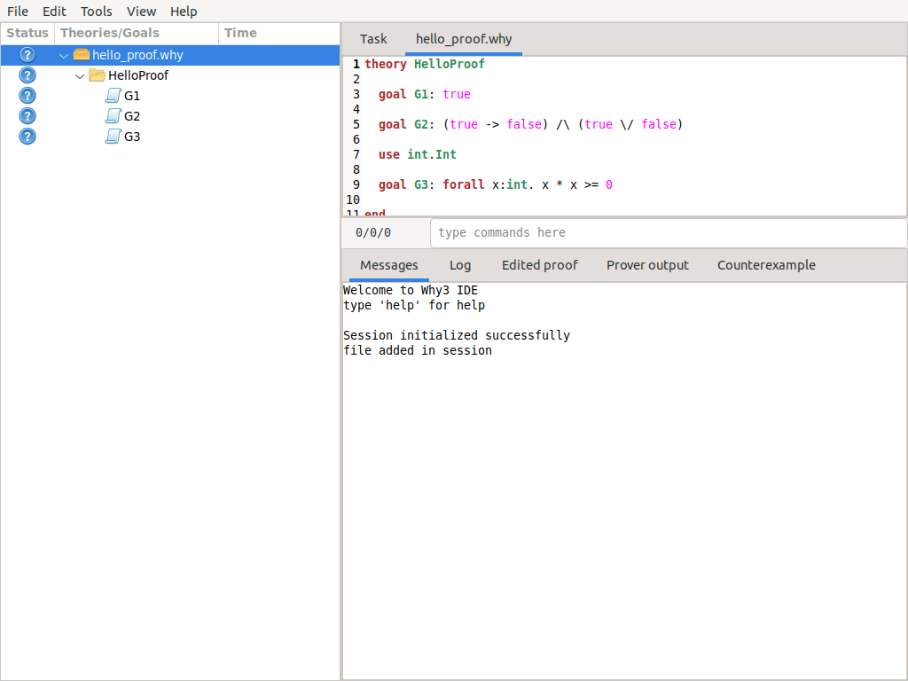
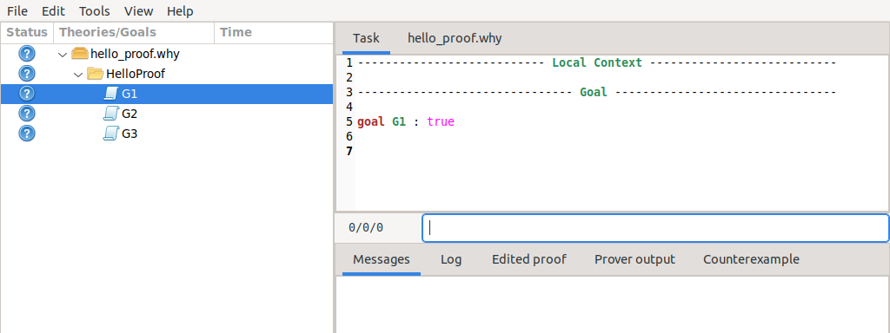
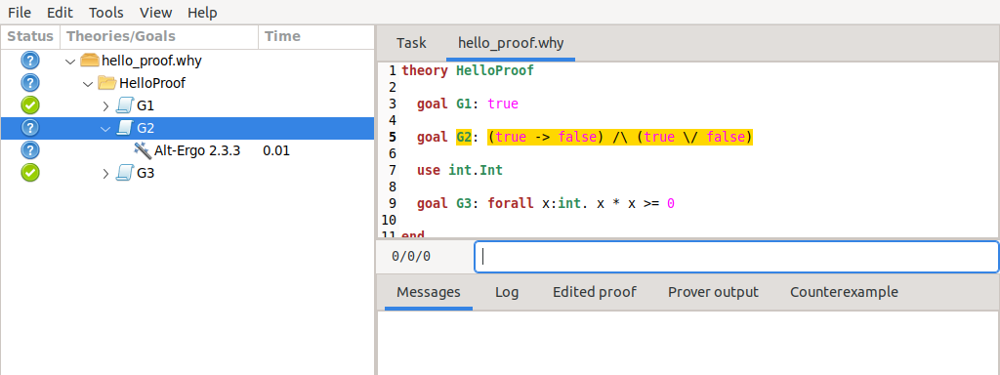
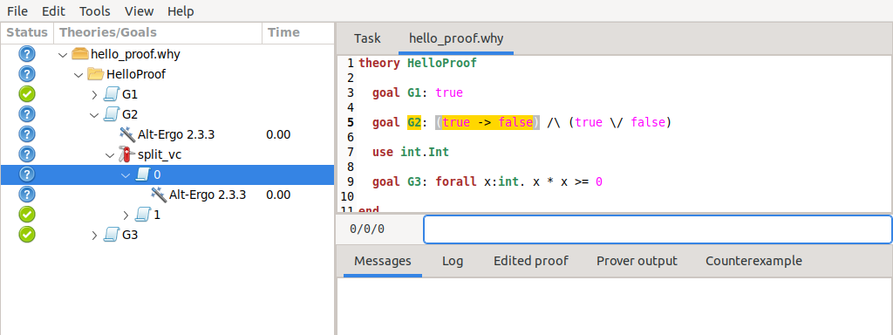
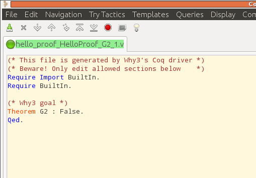
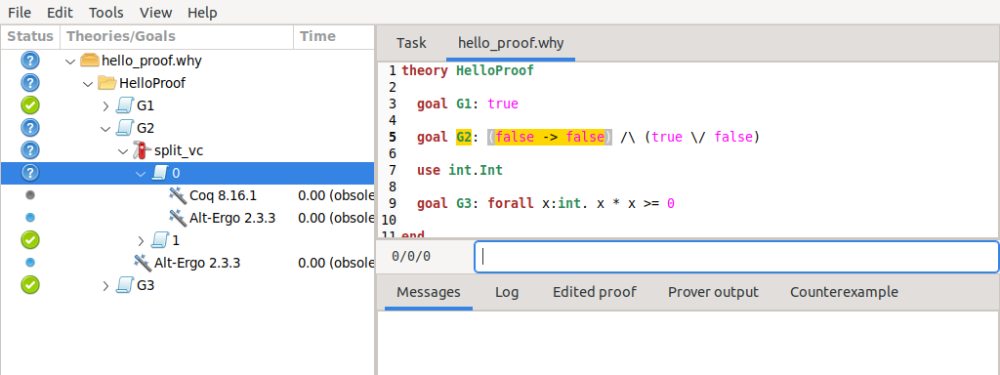

.. _chap.starting:

Getting Started
===============

Hello Proofs
------------

The first step in using Why3 is to write a suitable input file. When one
wants to learn a programming language, one starts by writing a basic
program. Here is our first Why3 file, which is the file
:file:`examples/logic/hello_proof.why` of the distribution. It contains a
small set of goals.

.. literalinclude:: ../examples/logic/hello_proof.why
   :language: whyml

Any declaration must occur inside a theory, which is in that example
called ``HelloProof``. It contains three goals named
:math:`G_1,G_2,G_3`. The first two are basic propositional goals,
whereas the third involves some integer arithmetic, and thus it requires
to import the theory of integer arithmetic from the Why3 standard
library, which is done by the ``use`` declaration above.

We don’t give more details here about the syntax and refer to
:numref:`chap.whyml` for detailed explanations. In the following, we
show how this file is handled in the Why3 GUI (:numref:`sec.gui`) then
in batch mode using the :program:`why3` executable (:numref:`sec.batch`).

.. _sec.gui:

Getting Started with the GUI
----------------------------

The graphical interface allows to browse into a file or a set of files,
and check the validity of goals with external provers, in a friendly
way. This section presents the basic use of this GUI. Please refer to
:numref:`sec.ideref` for a more complete description.

.. _fig.gui1:

   The GUI when started the very first time.

The GUI is launched on the file above as follows (here “``>``” is the
prompt):

::

    > why3 ide hello_proof.why

When the GUI is started for the first time, you should get a window that
looks like the screenshot of :numref:`fig.gui1`. The left part is a tree
view that allows to browse inside the theories. In this tree view, we
have a structured view of the file: this file contains one theory,
itself containing three goals.

.. _fig.gui2:

   The GUI with goal G1 selected.

In :numref:`fig.gui2`, we clicked on the row corresponding to goal
:math:`G_1`. The *task* associated with this goal is then displayed on
the top-right pane. The corresponding part of the input file is shown
when clicking the rightmost tab of that pane.

Calling provers on goals
~~~~~~~~~~~~~~~~~~~~~~~~

You are now ready to call provers on the goals. [1]_ A prover is
selected using the context menu (right-click). This prover is then
called on the goal selected in the tree view. You can select several
goals at a time, either by using multi-selection (typically by clicking
while pressing the Shift or Ctrl key) or by selecting the parent theory or the
parent file.

Let us now select the theory “HelloProof” and run the Alt-Ergo prover.
After a short time, you should get the display of :numref:`fig.gui3`.

.. _fig.gui3:

   The GUI after running the Alt-Ergo prover on each goal.

Goals :math:`G_1` and :math:`G_3` are now marked with a green “checked”
icon in the status column. This means that these goals have been proved
by Alt-Ergo. On the contrary, goal :math:`G_2` is not proved; it remains
marked with a question mark. You could attempt to prove :math:`G_2`
using another prover, though it is obvious here it will not succeed.

Applying transformations
~~~~~~~~~~~~~~~~~~~~~~~~

Instead of calling a prover on a goal, you can apply a transformation to
it. Since :math:`G_2` is a conjunction, a possibility is to split it
into subgoals. You can do that by selecting *Split VC* in the context menu. Now you
have two subgoals, and you can try again a prover on them, for example
Alt-Ergo. We already have a lot of goals and proof attempts, so it is a
good idea to close the sub-trees which are already proved: this can be
done by the menu *View/Collapse proved goals*, or even better by its shortcut “Ctrl-C”. You should
see now what is displayed on :numref:`fig.gui4`.

.. _fig.gui4:

   The GUI after splitting goal :math:`G_2`.

The first part of goal :math:`G_2` is still unproved. As a last resort,
we can try to call the Coq proof assistant, by selecting it in the
context menu. A new sub-row appear for Coq, and the Coq proof editor is
launched. (It is ``coqide`` by default; see :numref:`sec.ideref` for
details on how to configure this). You get now a regular Coq file to
fill in, as shown on :numref:`fig.coqide`. Please be mindful of the
comments of this file. They indicate where Why3 expects you to fill the
blanks. Note that the comments themselves should not be removed, as they
are needed to properly regenerate the file when the goal is changed. See
:numref:`sec.coq` for more details.

.. _fig.coqide:

   CoqIDE on subgoal 1 of :math:`G_2`.

Of course, in that particular case, the goal cannot be proved since it
is not valid. The only thing to do is to fix the input file, as
explained below.

Modifying the input
~~~~~~~~~~~~~~~~~~~

You can edit the source file, using the corresponding tab in the
top-right window of the GUI. Let us assume we change the goal
:math:`G_2` by replacing the first occurrence of ``true`` by ``false``,

.. code-block:: whyml

   goal G2 : (false -> false) /\ (true \/ false)

We can refresh the goals using menu *File/Save all and Refresh session*,
or the shortcut :kbd:`Control-r`. We get
the tree view shown on :numref:`fig.gui5`.

.. _fig.gui5:

   File reloaded after modifying goal :math:`G_2`.

The important feature to notice first is that all the previous proof
attempts and transformations were saved in a database — an XML file
created when the Why3 file was opened in the GUI for the first time.
Then, for all the goals that remain unchanged, the previous proofs are
shown again. For the parts that changed, the previous proofs attempts
are shown but marked with “(obsolete)” so that you know the results are
not accurate. You can now retry to prove all what remains unproved using
any of the provers.

Replaying obsolete proofs
~~~~~~~~~~~~~~~~~~~~~~~~~

Instead of pushing a prover’s button to rerun its proofs, you can
*replay* the existing but obsolete proof attempts, using menu *Tools/Replay obsolete*. By
default, *Replay* only replays proofs that were successful before. Notice that
replaying can be done in batch mode, using the :why3:tool:`why3 replay` command (see
:numref:`sec.why3replay`) For example, running the replayer on the
``hello_proof`` example is as follows (assuming :math:`G_2` still is
``(true -> false) /\ (true \/ false)``).

::

    > why3 replay hello_proof
     2/3 (replay OK)
       +--file ../hello_proof.why: 2/3
          +--theory HelloProof: 2/3
             +--goal G2 not proved

The last line tells us that no differences were detected between the
current run and the run stored in the XML file. The tree above reminds
us that :math:`G_2` is not proved.

Cleaning
~~~~~~~~

You may want to clean some of the proof attempts, removing the
unsuccessful ones when a project is finally fully proved. A proof or a
transformation can be removed by selecting it and using menu *Tools/Remove* or the
:kbd:`Delete` key. Menu *Tools/Clean* or shortcut :kbd:`C` perform an automatic removal of all
proofs attempts that are unsuccessful, while there exists a successful
proof attempt for the same goal. Beware that there is no way to undo
such a removal.

.. _sec.batch:

Getting Started with the Why3 Command
-------------------------------------

The :why3:tool:`why3 prove` command makes it possible to check the validity of goals
with external provers, in batch mode. This section presents the basic
use of this tool. Refer to :numref:`sec.why3prove` for a more complete
description of this tool and all its command-line options.

The very first time you want to use Why3, you should proceed with
autodetection of external provers. On the command line, this is done as
follows:

::

    > why3 config --detect

This prints some information messages on what detections are attempted.
To know which provers have been successfully detected, you can do as
follows.

::

    > why3 --list-provers
    Known provers:
      Alt-Ergo 1.30
      CVC4 1.5
      Coq 8.6

The first word of each line is a unique identifier for the associated
prover. We thus have now the three provers Alt-Ergo :cite:`ergo`,
CVC4 :cite:`barrett11cade`, and Coq :cite:`CoqArt`.

Let us assume that we want to run Alt-Ergo on the HelloProof example.
The command to type and its output are as follows, where the :option:`why3 prove -P`
option is followed by the unique prover identifier (as shown by
:option:`why3 --list-provers` option).

::

    > why3 prove -P Alt-Ergo hello_proof.why
    hello_proof.why HelloProof G1: Valid (0.00s, 1 steps)
    hello_proof.why HelloProof G2: Unknown (other) (0.01s)
    hello_proof.why HelloProof G3: Valid (0.00s, 1 steps)

Unlike the Why3 GUI, the command-line tool does not save the proof
attempts or applied transformations in a database.

We can also specify which goal or goals to prove. This is done by giving
first a theory identifier, then goal identifier(s). Here is the way to
call Alt-Ergo on goals :math:`G_2` and :math:`G_3`.

::

    > why3 prove -P Alt-Ergo hello_proof.why -T HelloProof -G G2 -G G3
    hello_proof.why HelloProof G2 : Unknown: Unknown (0.01s)
    hello_proof.why HelloProof G3 : Valid (0.01s)

Finally, a transformation to apply to goals before proving them can be
specified. To know the unique identifier associated to a transformation,
do as follows.

::

    > why3 --list-transforms
    Known non-splitting transformations:
      [...]

    Known splitting transformations:
      [...]
      split_goal_right

Here is how you can split the goal :math:`G_2` before calling Simplify
on the resulting subgoals.

::

    > why3 prove -P Alt-Ergo hello_proof.why -a split_goal_right -T HelloProof -G G2
    hello_proof.why HelloProof G2: Unknown (other) (0.01s)
    hello_proof.why HelloProof G2: Valid (0.00s, 1 steps)

:numref:`sec.transformations` gives the description of the various
transformations available.

.. [1]
   If not done yet, you must perform prover autodetection using
   :option:`why3 config --detect-provers`
